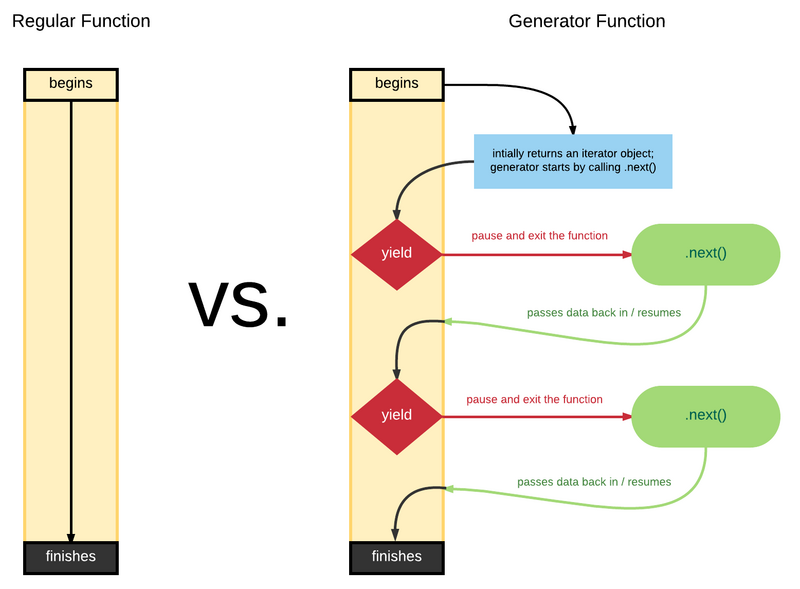
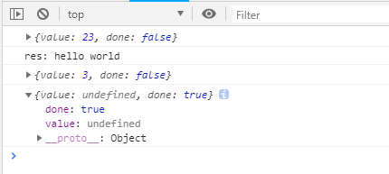

[TOC]
## 生成器Generators

```javascript
function makeGenerate(arr){
  let len = 0;
  return {
    next: () => {
      if (len < arr.length) {
        return {value: arr[len++], done: false}
      } else {
        return {done: true}
      }
    }
  }
}

const it = makeIterator(['吃饭','睡觉','打豆豆']);
console.log('1', it.next())
console.log('2', it.next())
console.log('3', it.next())
console.log('4', it.next())

function *makeIterator(arr){
  for (let i = 0; i < arr.length; i++) {
    yield arr[i];
  }
}


const gen = makeIterator(['吃饭','睡觉','打豆豆']);
console.log('1', gen.next())
console.log('2', gen.next())
console.log('3', gen.next())
console.log('4', gen.next())


```
### 什么是生成器

```javascript
function* quips(name) {
  yield "你好 " + name + "!";
  yield "希望你能喜欢这篇介绍ES6的译文";
  if (name.startsWith("X")) {
    yield "你的名字 " + name + "  首字母是X，这很酷！";
  }
  yield "我们下次再见！";
}

```

`解释：`这段代码看起来很像一个函数，我们称之为`生成器函数`，它与`普通函数有`很多共同点，但是二者有如下区别：

```
# 1.普通函数使用function声明，而生成器函数使用function*声明。
# 2.在生成器函数内部，有一种类似return的语法：关键字yield。二者的区别是，普通函数只可以return一次，而生成器函数可以yield多次（当然也可以只yield一次）。在生成器的执行过程中，遇到yield表达式立即暂停，后续可恢复执行状态。
```
这就是普通函数和生成器函数之间最大的区别，`普通函数不能自暂停，生成器函数可以`。

普通函数是一进入就必须执行完成的，而 Generator 可以多次暂停，让出控制权。

### 生成器做了什么

```javascript
//在浏览器控制台执行
> var iter = quips("jorendorff");
undefined
> iter.next()
{value: "你好 jorendorff!", done: false}done: falsevalue: "你好 jorendorff!"__proto__: Object
> iter.next()
{value: "希望你能喜欢这篇介绍ES6的译文", done: false}done: falsevalue: "希望你能喜欢这篇介绍ES6的译文"__proto__: Object
> iter.next()
{value: "我们下次再见！", done: false}
> iter.next()
{value: undefined, done: true}
```
`解释`：普通函数定义后，当你调用它们时，它们立即开始运行，直到遇到return或抛出异常时才退出执行。而生成器的调用看起来非常类似：quips("jorendorff")。但是，当你调用一个生成器时，它`并非立即执行`，而是返回一个`已暂停`的`生成器对象`（上述实例代码中的iter）。你可将这个生成器对象视为一次函数调用，只不过立即冻结了，它恰好在生成器函数的最顶端的第一行代码之前冻结了。
每当你调用生成器对象的`.next()`方法时，函数调用将其自身解冻并一直运行到下一个yield表达式，再次暂停。
这也是在上述代码中我们每次都调用iter.next()的原因，我们获得了quips()函数体中yield表达式生成的不同的字符串值。
调用最后一个iter.next()时，我们最终抵达生成器函数的`末尾`，所以返回结果中done的值为`true`。抵达函数的末尾意味着没有返回值，所以返回结果中value的值为`undefined`。

**Generator函数中的next方法可以接收参数**
说明：
.next(params)方法中传入的参数params，其实是把上一个yield语句的返回值给覆盖了。另外第一个next()方法是启动器，在它之前没有yield语句，所以，给第一个next()方法传入参数是没有意义的。
```javascript
<!DOCTYPE html>
<html lang="en">
<head>
    <meta charset="UTF-8">
    <title>Title</title>
    <style>
        html, body {
            height: 500%;
        }
    </style>
</head>
<body>
<script type="text/javascript">
  function* test() {
    var n = 1;
    var res = yield n + 22;
    console.log("res:", res);
    yield ++n;
    yield ++n;
  }

  var g = test();
  // 第一个next
  console.log(g.next()) // 23
  // 第二个next
  /*
   传入的参数，把上一个yieldy语句的返回值给覆盖了，上一个yield语句的返回值是: yield = n + 22,
   传入的参数是 hello world, 所以yield 语句的返回值就编程了 yield = "hello world", 然后赋值给变量res，所以打印结果为hello world
  * */
  g.next("hello world")
  // 第三个next
  console.log(g.next());
  // 第四个next,没有yield语句，value 为undefined
  console.log(g.next());
</script>
</body>
</html>

```



