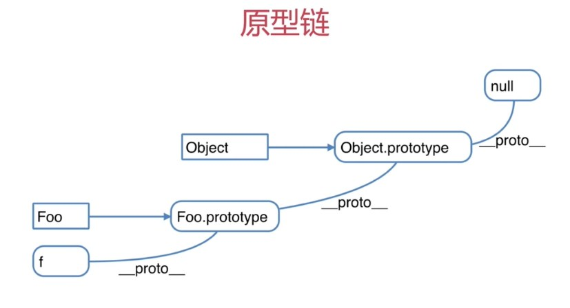

[TOC]
## 原型
```javascript
// 原型规则和示例

# 1.所有的引用类型(数组，对象，函数)，都有一个__proto__属性(隐式原型)，属性值是一个普通的对象。
var obj ={} ; obj.age = 10; // 构造函数就是new Object()
var arr = []; arr.age = 20; //构造函数就是new Array()
var fn = function(){}; fn.age = 30; //构造函数就是 Function(){}


console.log(obj.__proto__);
console.log(arr.__proto__);
console.log(fn.__proto__);


# 2.所有的函数，都有一个prototypes属性(显示原型)，属性值也是一个普通的对象
function fn(){}
fn.age = 100;
console.log(fn.prototype);


# 3.所有的引用类型(数组，对象，函数)，__proto__属性(隐式原型)指向它的构造函数的"prototype"属性(显示原型)值

console.log(obj.__proto__ === Object.prototype); // True
console.log(arr.__proto__ === Array.prototype); //True
console.log(fn.__proto__ === Function.prototype); // True


# 4.当试图得到一个引用类型(数组，对象，函数)的某个属性时，如果这个引用类型本身没有这个属性，那么会去它的__proto__(及它的构造函数的prototype)中寻找。

//构造函数
function Foo(name,age){
    this.name = name
}

Foo.prototype.alertName = function (){
    alert(this.name);
}

//创建示例
var f = new Foo("zhangsan");
f.printName = function(){
    console.log(this.name)
}

//测试
f.printName();
f.alertName(); //f是一个函数，有隐式原型，函数的隐式原型等同于它构造函数的显示原型，所以这里可以用alertName属性。但是在遍历时，如果只希望得到自身的属性，可以使用hasOwnProperty()来进行判断
var item;
for (item in f) {
    //循环对象自身的属性
    if(f.hasOwnProperty(item)){
        console.log(item); //name，printName
    }
}


// 原型链
f.toString(); //要去f.__proto__.__proto__中找


// 如何准确判断一个变量是数组类型
var  arr = [];
arr instancsof Array //True
typeof arr; //object, typeof无法判断是否是数组


// 写一个原型链继承的例子
// 动物
function Animal(){
    this.eat = function(){
        console.log("animal eat")
    }
}

// 狗
function Dog(){
    this.bark = function(){
        console.log("dog bark")
    }
}

Dog.prototype = new Animal()
// 哈士奇
var hashiqi = new Dog()


// 贴近实战的原型链示例

function Elem(id){
    this.elem = document.getElementById(id)
}


Elem.prototype.html = function(val){
    var elem = this.elem;
    if (val){
        elem.innerHTML = val;
        return this //链式操作
    } else{
        return elem.innerHTML;
    }
}

Elem.prototype.on = function(type.fn){
    var elem = this.elem;
    elem.addEventListener(type,fn)
}

var div1 = new Elem("div1");

console.log(div1.html());


// 作用域
// 函数声明 和变量声明 会被前置

function fn(){
    //函数声明
}
// 函数表达式不会被前置

var fn1 = function(){
    //函数表达式
};


console.log(a);
var a;

fn("aa");
function fn(name){
    console.log(name);
}


// 异步非阻塞
console.log(100);
setTimeout(function(){
    console.log(200);
},1000);
console.log(300);


// 同步阻塞
console.log(10);
alert(20);
console.log(30);
```
## 原型链





